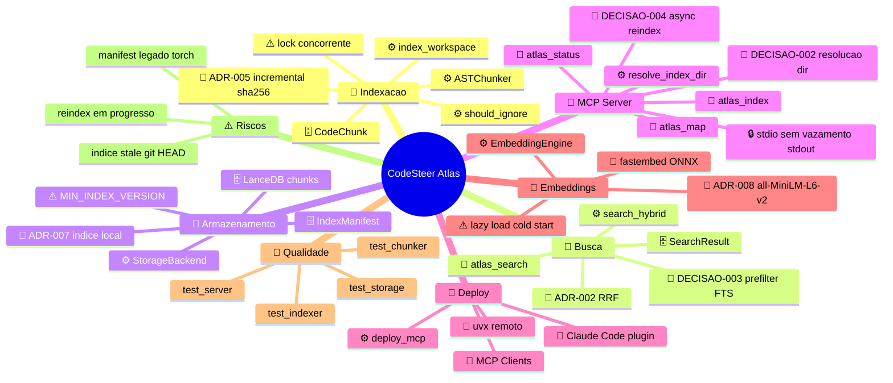

# CodeSteer Atlas — Mindmap Enriquecido (Zettelkasten)

> Classificação semântica · máx. 4 níveis · fonte: MCP Atlas + código real
> Data: 2026-06-13

## Legenda de prefixos

| Prefixo | Uso no Atlas |
|---------|----------------|
| 🧩 | Domínio funcional (indexação, busca, MCP…) |
| 📡 | Tool MCP / interface de rede |
| ⚙️ | Serviço / módulo Python |
| 🗄️ | Entidade Pydantic ou tabela LanceDB |
| 🔗 | Integração externa (fastembed, LanceDB, clientes) |
| 🔒 | Segurança / isolamento local |
| 🧪 | Suíte de testes |
| ⚠️ | Risco ou limitação conhecida |
| 📐 | ADR / decisão arquitetural |
| 💡 | Roadmap — *nenhum item explícito no input atual* |

## Vault Obsidian

Estrutura completa em [[docs/vault/00-MOC/MOC-Home|vault/00-MOC/MOC-Home.md]].
