# Guia didático — Indexação, Grafo e MCP no CodeSteer Atlas

> **Para quem é este guia:** desenvolvedores e agentes de IA que querem entender
> *como* o Atlas transforma código em índice pesquisável, *como* consultar via MCP
> e *como* usar o grafo de conectividade.
>
> **Pré-requisito:** Python 3.11+ com [uv](https://github.com/astral-sh/uv) e o
> workspace indexado ao menos uma vez.

---

## Sumário

1. [Visão geral em 30 segundos](#1-visão-geral-em-30-segundos)
2. [Arquitetura do sistema](#2-arquitetura-do-sistema)
3. [Pipeline de indexação](#3-pipeline-de-indexação)
4. [Artefatos em `.code-index/`](#4-artefatos-em-code-index)
5. [Indexação incremental](#5-indexação-incremental)
6. [Pastas, subpastas e multi-repo](#6-pastas-subpastas-e-multi-repo)
7. [Ferramentas MCP](#7-ferramentas-mcp)
8. [Busca vs grafo — quando usar cada um](#8-busca-vs-grafo--quando-usar-cada-um)
9. [Grafo de conhecimento](#9-grafo-de-conhecimento)
10. [Visualizador `graph.html`](#10-visualizador-graphhtml)
11. [Enriquecendo o grafo](#11-enriquecendo-o-grafo)
12. [Fluxos práticos passo a passo](#12-fluxos-práticos-passo-a-passo)
13. [Perguntas frequentes](#13-perguntas-frequentes)

---

## 1. Visão geral em 30 segundos

O **CodeSteer Atlas** é um servidor **MCP** (Model Context Protocol) que roda **100%
local**. Ele:

1. **Indexa** seu código e documentos → gera chunks + embeddings + grafo.
2. **Busca** semanticamente (`atlas_search`) combinando vetores e BM25.
3. **Explora conexões** (`atlas_graph`) entre código, docs e decisões arquiteturais.

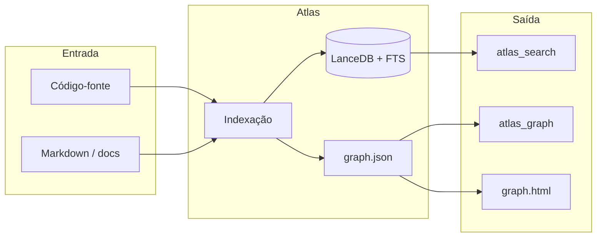

**Analogia:** pense no índice como um **catálogo de biblioteca** (busca por assunto)
e no grafo como um **mapa de referências cruzadas** (quem cita quem, quem importa quem).

---

## 2. Arquitetura do sistema

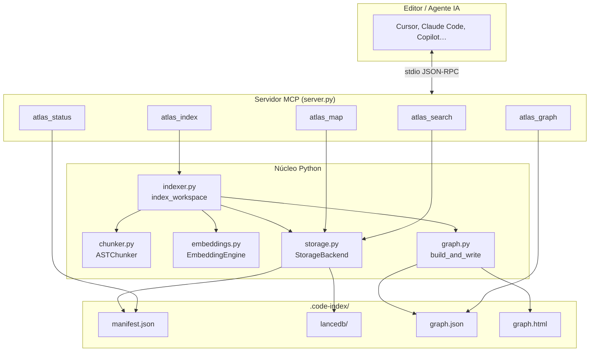

| Módulo | Papel |
|--------|-------|
| `indexer.py` | Orquestra varredura, hash, chunk, embed e persistência |
| `chunker.py` | Parse AST (Tree-sitter) → chunks por símbolo |
| `embeddings.py` | Vetores 384d com `all-MiniLM-L6-v2` (fastembed/ONNX) |
| `storage.py` | LanceDB + índice FTS (BM25) + manifest |
| `graph.py` | Deriva `graph.json` a partir do índice |
| `server.py` | Expõe tools MCP; resolve onde fica `.code-index/` |

---

## 3. Pipeline de indexação

A função central é `index_workspace()`. Ela executa **6 fases** com progresso no stderr:

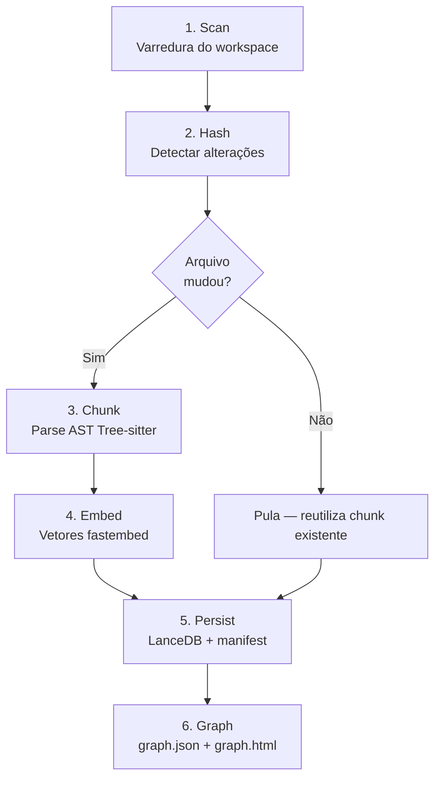

### Fase 1 — Scan

- Percorre o workspace (ou subpastas informadas em `--paths`).
- Ignora: `node_modules`, `.git`, `__pycache__`, arquivos ocultos, entradas em `.atlasignore`.
- Aceita extensões suportadas (Python, JS/TS, Go, Markdown, SQL, etc.).
- Descarta arquivos **> 2 MB**.
- Captura `mtime` e `size` de cada arquivo (otimização incremental).

### Fase 2 — Hash

- Compara cada arquivo com o `manifest.json` anterior.
- **Fast path:** se `mtime + size` iguais → reutiliza hash sha256 sem reler o disco.
- **Slow path:** calcula sha256 do conteúdo.
- Arquivos deletados são marcados para remoção do índice.

### Fase 3 — Chunk

- `ASTChunker` faz parse Tree-sitter e extrai **classes, funções, métodos**.
- Markdown vira chunks por **seção (heading)**.
- Sem símbolos AST → fallback para chunk `module` (arquivo inteiro).
- Extrai **imports** e **rationale refs** (`DECISAO-005`, `NOTE:`, wikilinks).

### Fase 4 — Embed

- Apenas chunks **novos ou alterados** são embedados (economia de tempo).
- Modelo: `sentence-transformers/all-MiniLM-L6-v2` (384 dimensões).
- Processamento em lotes de 32.

### Fase 5 — Persist

- Grava chunks no **LanceDB** com coluna vetorial + texto para FTS.
- Atualiza `manifest.json` (mapa arquivo → hash, metadados, git HEAD).
- Modo incremental: `delete` dos alterados + `append` dos novos.

### Fase 6 — Graph

- Reconstrói `graph.json` e gera `graph.html` autocontido.

### Como disparar a indexação

```bash
# Incremental (padrão) — só processa o que mudou
uv run atlas-index --workspace .

# Rebuild completo — ignora cache de hashes
uv run atlas-index --workspace . --full

# Subpastas específicas
uv run atlas-index --workspace . --paths src --paths docs
```

Via MCP: tool `atlas_index` (com opções `paths`, `full`, `dry_run`).

---

## 4. Artefatos em `.code-index/`

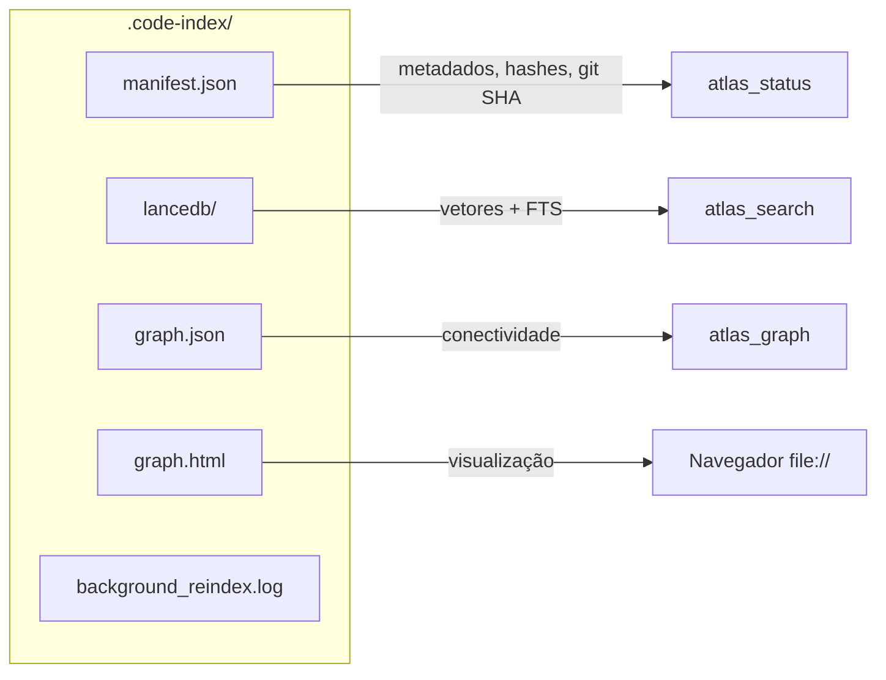

| Arquivo | Conteúdo | Usado por |
|---------|----------|-----------|
| `manifest.json` | Hashes, repos, idiomas, versão do índice, git HEAD | `atlas_status`, incremental |
| `lancedb/` | Tabela `chunks` com vetores e texto | `atlas_search`, `atlas_map` |
| `graph.json` | Nós (arquivos, símbolos, docs) e arestas (imports, cites…) | `atlas_graph` |
| `graph.html` | Viewer offline com pan/zoom e filtros | Humano (duplo-clique) |

> **Versão mínima:** grafo exige índice `2.1.0+`. Índices `2.0.0` ainda buscam,
> mas não têm `graph.json`.

---

## 5. Indexação incremental

A indexação incremental evita reprocessar arquivos inteiros a cada execução.

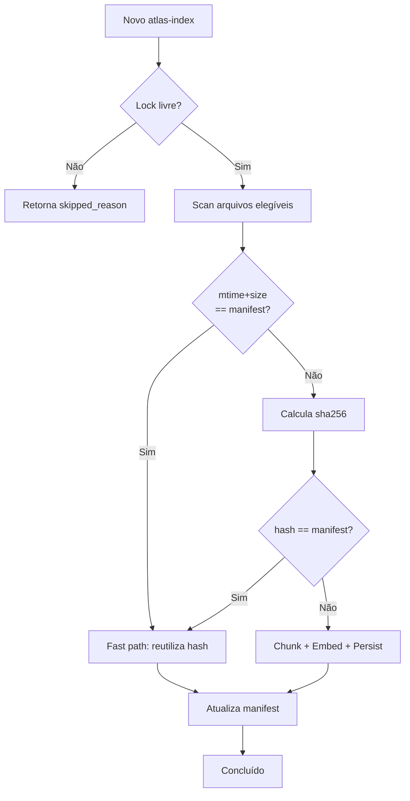

| Flag | Efeito |
|------|--------|
| *(padrão)* | Incremental — só arquivos novos/alterados/removidos |
| `--full` | Ignora hashes; reprocessa tudo no escopo |
| `--paths src` | Restringe scan **e** remoções à subárvore `src/` |

**Staleness (`is_stale`):** compara o `git HEAD` do workspace com o gravado no
manifest. Só funciona se a **raiz do workspace** for um repositório git.

---

## 6. Pastas, subpastas e multi-repo

### Várias subpastas no mesmo workspace

**Sim** — repita `--paths`:

```bash
uv run atlas-index -w . -p frontend -p backend -p shared
```

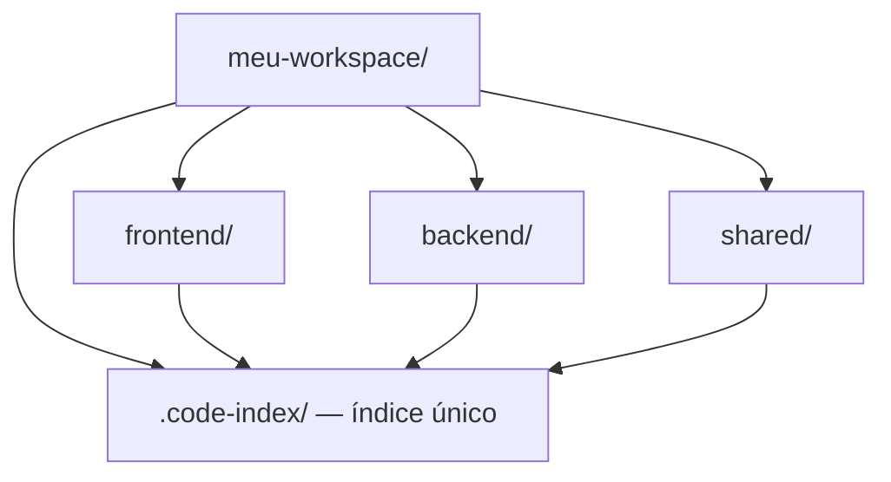

Na busca, filtre por repo lógico com `path_prefix`:

```text
atlas_search(query="middleware auth", path_prefix="backend/")
```

### Workspace com vários repos git dentro

Funciona indexando a **pasta pai**. Limitações atuais:

| Aspecto | Comportamento |
|---------|---------------|
| Campo `repo` nos chunks | Nome da pasta workspace (`meu-workspace`), não `frontend`/`backend` |
| Filtro `repo` no MCP | Pouco útil — prefira `path_prefix` |
| `git_head_sha` | Só da raiz; repos filhos com `.git` próprio não alimentam staleness |
| **MCP e múltiplos `.code-index`** | **Um índice por processo** — não mergeia dois `.code-index` |

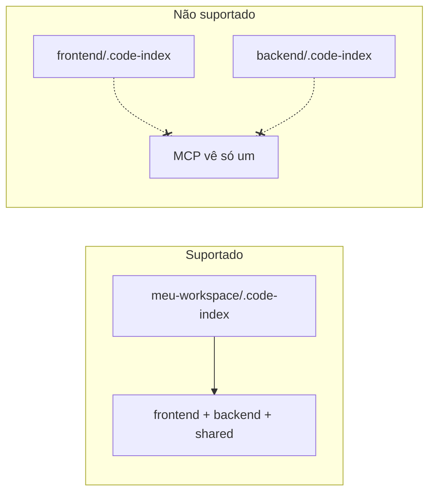

**Recomendação:** um `.code-index` na raiz do workspace que engloba todos os repos.

---

## 7. Ferramentas MCP

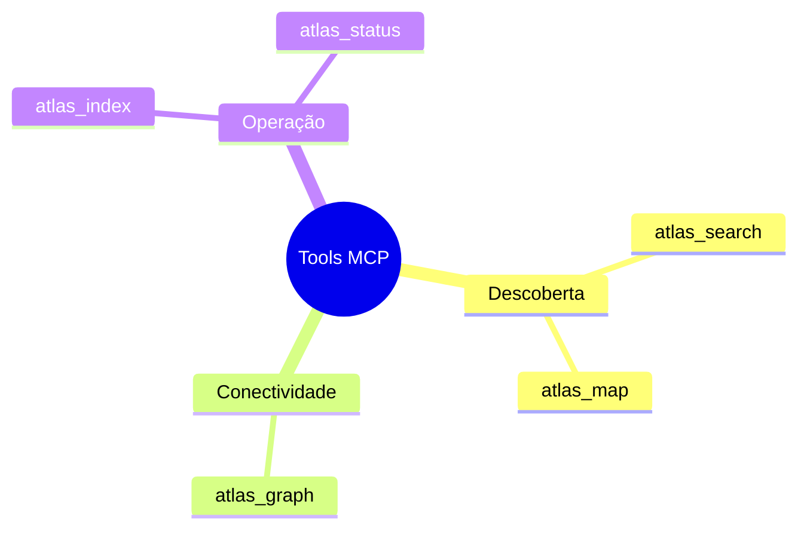

| Tool | Quando usar | Retorno típico |
|------|-------------|----------------|
| `atlas_search` | "Onde está X?" / "Como funciona Y?" | `file_path`, linhas, símbolo, score |
| `atlas_map` | Visão estrutural do projeto | Árvore de classes/funções |
| `atlas_graph` | Conectividade, hubs, caminhos | Nós, arestas, vizinhança |
| `atlas_status` | Diagnóstico do índice | stale?, chunks, `graph_viewer_path` |
| `atlas_index` | Criar/atualizar índice | stats ou job em background |

### Fluxo recomendado para agentes

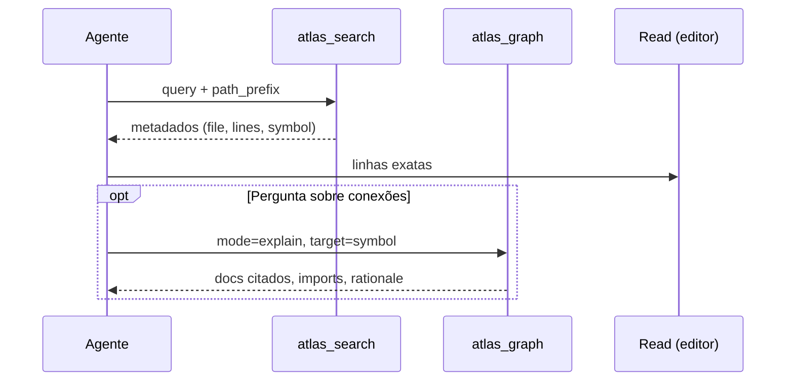

1. **`atlas_search`** com metadados only (`include_content=false`).
2. **`Read`** nas linhas retornadas.
3. **`atlas_graph(explain)`** se precisar de contexto arquitetural.
4. **`grep`** só para confirmar string literal exata.

---

## 8. Busca vs grafo — quando usar cada um

| Pergunta | Tool correta |
|----------|--------------|
| Onde está implementado `index_workspace`? | `atlas_search` |
| Quais decisões arquiteturais este código cita? | `atlas_graph(explain)` |
| Como o símbolo A se conecta ao doc B? | `atlas_graph(path)` |
| Quais notas/docs são centrais no projeto? | `atlas_graph(hubs)` |
| Estrutura de classes de um módulo | `atlas_map` |
| Explorar clusters visualmente | `graph.html` |

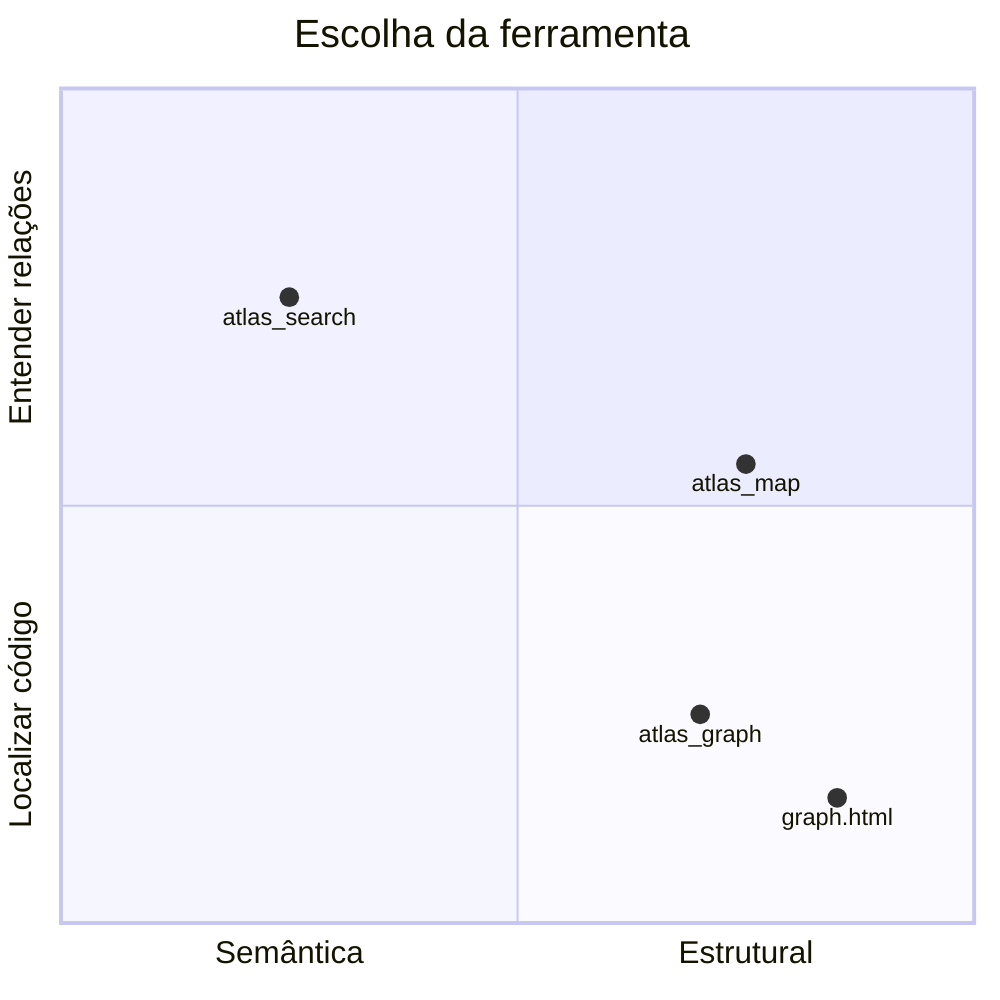

---

## 9. Grafo de conhecimento

O grafo é **derivado** do índice — reconstruído a cada indexação. Não é busca
semântica; é um mapa de **relações explícitas** extraídas do código e dos docs.

### Tipos de nó

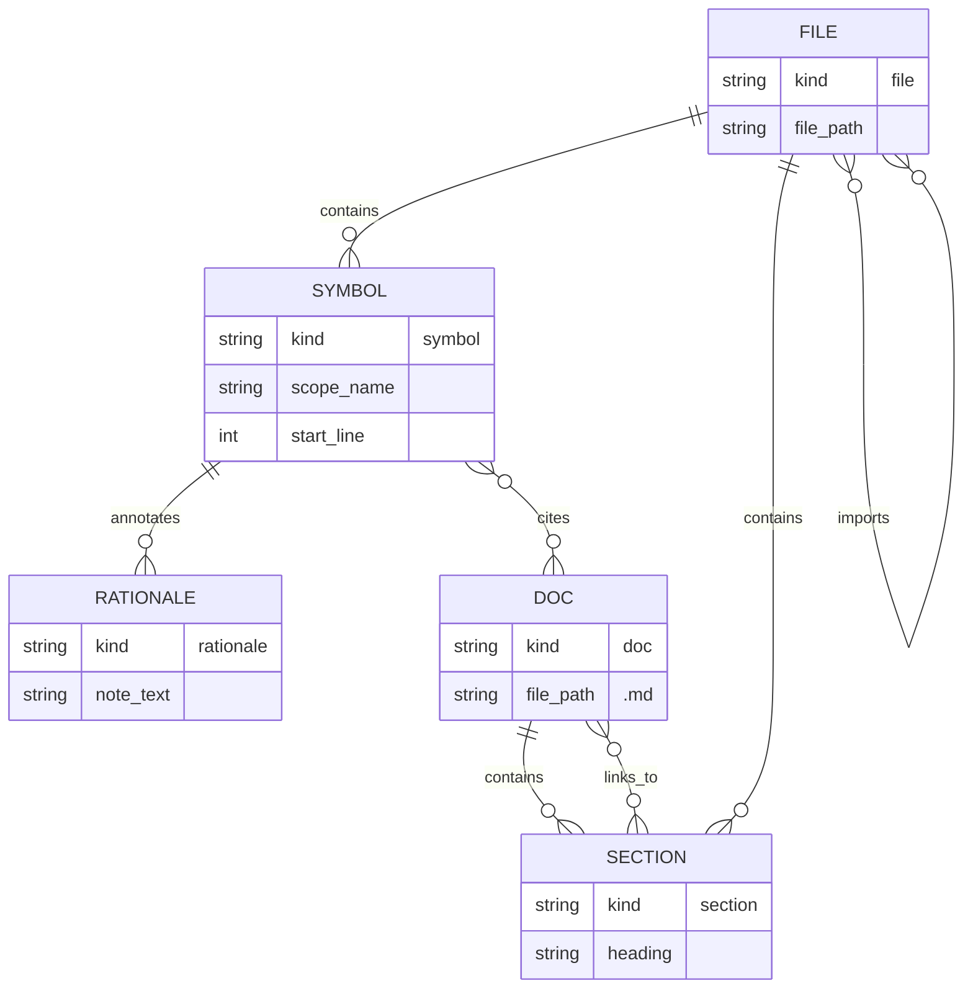

| `kind` | Exemplo de id | Origem |
|--------|---------------|--------|
| `file` | `file:src/app.py` | Todo arquivo indexado |
| `doc` | `file:docs/dec-001.md` | Arquivo `.md` |
| `symbol` | `sym:src/app.py#login` | Função/classe/método |
| `section` | `sec:README.md#Instalação` | Heading markdown |
| `rationale` | `rat:a1b2c3…` | Comentário `NOTE:` / `WHY:` |

### Tipos de aresta

| `kind` | Significado | Exemplo |
|--------|-------------|---------|
| `contains` | Arquivo contém símbolo/seção | `indexer.py` → `index_workspace` |
| `imports` | Import Python ou JS/TS relativo | `server.py` → `storage.py` |
| `links_to` | Link/wikilink em markdown | `index.md` → `dec-002.md` |
| `cites` | Referência `DECISAO-005` no código | função → doc de decisão |
| `annotates` | Comentário rationale no símbolo | `# WHY: …` → nó rationale |

### Tool `atlas_graph` — três modos

#### `hubs` — nós mais conectados

Encontra documentos e código “centrais” (maior grau de conexão).

```text
atlas_graph(mode="hubs", top_n=10)
```

Útil para: *"Por onde começo a entender este projeto?"*

#### `explain` — vizinhança de um nó

```text
atlas_graph(mode="explain", target="index_workspace")
```

Retorna vizinhos agrupados por tipo: arquivos, docs citados, rationale.

O `target` aceita:
- nome do símbolo (`StorageBackend`)
- caminho de arquivo (`src/codesteer_atlas/server.py`)
- sufixo único (`dec-002-resolucao-index-dir.md`)

#### `path` — caminho entre dois nós

Busca em largura (BFS), até 10 saltos:

```text
atlas_graph(
  mode="path",
  source="index_workspace",
  target="dec-002-resolucao-index-dir.md"
)
```

Exemplo de caminho real:

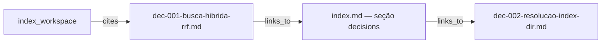

---

## 10. Visualizador `graph.html`

Após indexar, abra o arquivo gerado:

```bash
# macOS
open .code-index/graph.html

# Linux
xdg-open .code-index/graph.html
```

Ou use o caminho em `atlas_status` → `graph_viewer_path`.

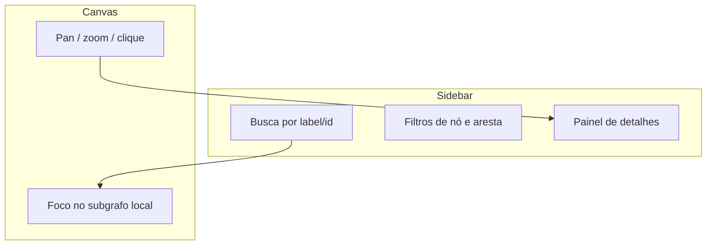

| Controle | Ação |
|----------|------|
| Campo de busca | Filtra nós por label ou id |
| Clique em nó | Foca subgrafo local + detalhes |
| Filtros | Mostra/oculta tipos de nó e aresta |
| Recentralizar | Volta ao layout inicial |
| Limpar foco | Remove seleção |
| Expandir tudo | Aparece em grafos grandes (> 3000 nós) |

**Modo hubs-only:** grafos muito grandes abrem resumidos nos hubs centrais.
Use "Expandir tudo" se precisar ver mais.

**Debug:** adicione `?debug=1` na URL para estatísticas extras.

---

## 11. Enriquecendo o grafo

Quanto mais referências explícitas no código e nos docs, mais denso fica o grafo.

### No código — cites arquiteturais

```python
# DECISAO-005: embeddings locais com fastembed
def encode(self, texts: list[str]) -> list[list[float]]:
    ...
```

Padrões reconhecidos: `DECISAO-003`, `DEC-002`, `ADR-001`, `RFC-012`.

### No código — anotações rationale

```python
# WHY: stdio deve permanecer limpo para o canal MCP JSON-RPC
# NOTE: redirect acontece antes de importar lancedb
```

### Em markdown — links e wikilinks

```markdown
Ver [[dec-002-resolucao-index-dir]] para resolução do índice.

Consulte [indexação incremental](../decisions/dec-003-indexacao-incremental.md).
```

### Imports (automático)

- **Python:** `from codesteer_atlas.storage import StorageBackend`
- **JS/TS:** imports relativos `./utils` ou `../lib`

Após adicionar referências, reindexe:

```bash
uv run atlas-index --workspace .
```

---

## 12. Fluxos práticos passo a passo

### Primeira vez no projeto

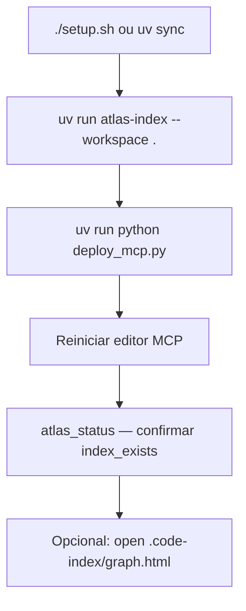

### Explorar uma feature desconhecida

1. `atlas_search(query="autenticação JWT", path_prefix="src/")`
2. `Read` nos hits com melhor score.
3. `atlas_graph(mode="explain", target="AuthMiddleware")`
4. Ler docs citados (`dec-xxx.md`) retornados pelo grafo.

### Atualizar após mudanças grandes

1. `atlas_status` → se `is_stale: true`, rodar `atlas_index`.
2. Ou direto: `uv run atlas-index --workspace .`
3. Reindex completo raro: `--full` apenas se manifest corrompido ou upgrade de versão.

### Workspace multi-repo

1. Abrir a **pasta pai** no editor (não multi-root com índices separados).
2. `uv run atlas-index --workspace /caminho/meu-workspace`
3. Buscar com `path_prefix="nome-do-repo/"`.

---

## 13. Perguntas frequentes

**Preciso reindexar a cada commit?**
Não necessariamente. A indexação incremental detecta arquivos alterados por hash.
Use `atlas_status` ou reindexe quando a busca parecer desatualizada.

**Posso indexar só `src/`?**
Sim: `--paths src`. O restante do índice permanece intacto.

**O MCP funciona offline?**
Sim. Embeddings e LanceDB são 100% locais. Nenhum código sai da máquina.

**Por que `atlas_graph` falha com "graph.json não encontrado"?**
O índice foi criado antes da versão `2.1.0` ou a indexação não completou a fase
Graph. Rode `uv run atlas-index --workspace . --full`.

**Posso ter dois `.code-index` ativos no MCP?**
Não na mesma instância. O servidor resolve **um** índice por processo. Use índice
unificado na pasta pai ou registre servidores MCP separados com `ATLAS_INDEX_DIR`
diferente (configuração avançada).

**Qual a diferença entre `atlas_search` e `grep`?**
`atlas_search` entende **conceitos** ("middleware de autenticação").
`grep` encontra **strings exatas** (`def authenticate(`). Use Atlas primeiro;
grep para confirmar literais.

---

## Referências

- [README](../README.md) — instalação e início rápido
- [Documentação visual](index.html) — conceitos MCP e busca híbrida
- [CLAUDE.md](../CLAUDE.md) — arquitetura técnica para agentes
- Código-fonte: `src/codesteer_atlas/indexer.py`, `graph.py`, `server.py`

---

*Última atualização: julho/2026 · CodeSteer Atlas 2.1.0+*
